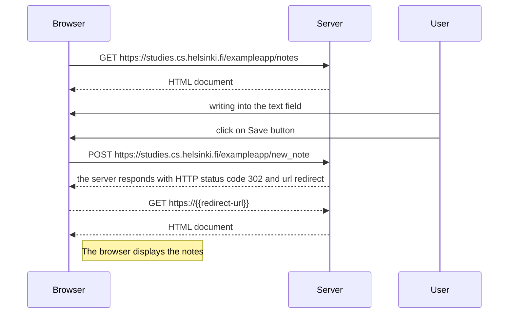

```mermaid
sequenceDiagram
    
    Browser->>Server: GET https://studies.cs.helsinki.fi/exampleapp/notes
    Server-->>Browser: HTML document
    User->>Browser: writing into the text field
    User->>Browser: click on Save button
    Browser->>Server: POST https://studies.cs.helsinki.fi/exampleapp/new_note
    Server-->>Browser: the server responds with HTTP status code 302 and url redirect
    Browser-->>Server: GET https://{{redirect-url}}
    Server-->>Browser: HTML document


    Note right of Browser: The browser displays the notes

```